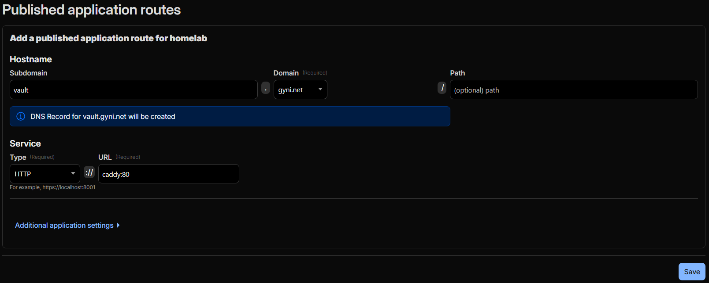

This post documents the architecture and implementation of my security-first homelab, built on Arch Linux and Docker.

The goal wasn’t just to self-host services, but to design a setup that minimizes exposure, centralizes authentication, and separates concerns cleanly. Instead of forwarding ports directly or exposing services blindly, I built a layered approach using Cloudflare Tunnel, Caddy, Authelia, and Tailscale to control exactly how traffic enters and moves through the system.

This homelab serves as both a learning environment and a practical security playground where I can experiment with containerization, reverse proxies, authentication flows, and remote administration without compromising my home network.

# Setting up the Homelab

## Hardware and Network Setup

### Hardware
I decided to use my old PC setup that I've had for a while, which houses these specs:

- Gigabyte H410M Motherboard 
- Intel Core i3-10100F (4 Cores and 8 Threads) @ 4.30 GHz
- DDR4 32GB RAM @ 2666MHz
- 256GB NVMe SSD for the OS and services
- Gigabit Ethernet
- No **dGPU** *or* **iGPU** - This is a **headless** setup, so I don't need any graphics capabilities.

Despite its modest specs, it's surprisingly more than capable of running multiple services simultaneously without any issues. I also have a secondary machine that is a bit more powerful that I use for testing and experimentation but plan to migrate to that machine as the primary server in the future when I need more resources.

### Network
For my network setup, I have a 70Mbps VDSL2 connection, which is sufficient for my use case. I don't have any plans to run bandwidth-intensive services that would require more than that, and I primarily use this homelab for learning and testing rather than hosting high-traffic applications.

## Choosing the Base OS
Previously, I had used **TrueNAS** and **Proxmox** for homelabs, but this time around I chose to use **Arch Linux** as the base OS for its flexibility and control. Realistically you can use any Linux distribution that supports **Docker** and the services you want to run, most users would prefer to use **Debian** for its stability and wide support. However, I prefer Arch for its **rolling release model** and the ability to easily customize my setup. In a production environment, I would likely opt for a more **stable distribution**, but for a homelab where I'm experimenting and learning, Arch gives me the freedom to tinker and stay on the **cutting edge**.

I have an [8 Port Gigabit Network switch from Mercusys](https://www.mercusys.com/en/product/details/ms108gs/) that connects my home network together, including my homelab.

# Docker and Containerization

## Why Docker?

I chose Docker as the backbone of my lab for its modularity, ease of use, and isolation capabilities. By containerizing each service, I can spin things up quickly, isolate applications, and keep my environment clean and manageable. Using a shared Docker network and a structured approach for docker-compose and data files makes backups simple and reduces configuration headaches.

### Key Services and Tools

- **[Authelia](https://hub.docker.com/r/authelia/authelia)**: Handles authentication for users connecting from the internet. It's my first line of defense and keeps everything secure behind authentication.
- **[Portainer](https://hub.docker.com/r/portainer/portainer-ce)**: A local-only dashboard for monitoring containers and managing resources. It's a great way to keep an eye on what's running and manage my services without needing to use the command line all the time.
- **[Caddy](https://hub.docker.com/_/caddy/)**: I opted for Caddy instead of Nginx because it's modern and plugin-friendly, and I wanted to explore what it had to offer. It routes traffic cleanly to each subdomain/service and handles authentication redirecting.
- **[Tailscale](https://tailscale.com/)**: Provides secure remote administration. I can access my homelab anywhere without exposing it directly to the internet. (This is installed on the host machine, not in a container as I want to have access to the host for management).
- **[Vaultwarden](https://hub.docker.com/r/vaultwarden/server)**: My self-hosted password manager for storing logins and TOTP secrets to generate codes securely.
- **[Cloudflare Tunnel](https://hub.docker.com/r/cloudflare/cloudflared)**: Maps subdomains to my Caddy instance, allowing me to expose only what I need while keeping everything else behind the tunnel. I benefit from Cloudflare's security features without worrying about exposing my entire network.
- **[FileBrowser](https://hub.docker.com/r/filebrowser/filebrowser/)**: Lets me access my files remotely with a simple interface. It's a great way to manage files without needing to set up something more complex like Nextcloud.
- **[IT-Tools](https://hub.docker.com/r/corentinth/it-tools/)**: A collection of handy tools I can use on the go.
- **[mitmproxy](https://hub.docker.com/r/mitmproxy/mitmproxy/)**: A powerful tool for intercepting and analyzing HTTP traffic, which is valuable for learning about web security and debugging applications.

### Structure and Automation

I focused heavily on clean structure and automation. Each service has its own directory with separate configuration and data files. This makes updates and backups straightforward. With Docker and docker-compose, I can rebuild services in seconds, which is very convenient when experimenting or testing new tools.

### Docker Compose Example for Caddy:
```yaml
services:
  caddy:
    container_name: caddy
    image: caddy:latest
    restart: unless-stopped
    volumes:
      - ../../data/caddy/conf:/etc/caddy
      - ../../data/caddy/site:/srv
      - ../../data/caddy/data:/data
      - ../../data/caddy/config:/config

networks:
  default:
    external: true
    name: shared
```

As you can see, I mount separate volumes for configuration, site files, and data, which keeps everything organized and makes it easy to manage. This structure allows me to quickly swap out configurations or update services without affecting the underlying data, which is crucial for maintaining a stable and secure homelab environment.

The structure of my directory is as follows:
```text
docker
├── containers
│   ├── authelia
│   │   └── docker-compose.yml
│   └── caddy
│       └── docker-compose.yml
└── data
    ├── authelia
    │   ├── config
    │   └── secrets
    └── caddy
        ├── conf
        ├── config
        ├── data
        └── site
```

If you'd like to see how to set up docker in a similar fashion, check out my [Optimal Modular Docker Container Setup](/posts/optimal-modular-docker-structure/) post where I go into more detail on how to structure your docker setup for maximum efficiency and scalability.

# Using Cloudflare Tunnel for Domain Mapping
To expose my services to the internet, I use Cloudflare Tunnel. This allows me to map specific subdomains to my Caddy instance without exposing my entire network. It's a great way to keep things secure while still allowing access to the services I want to share. 

For example, I can map `vault.gyni.net` to my Vaultwarden instance running in Docker, and `files.gyni.net` to my FileBrowser instance, all while keeping the rest of my homelab hidden behind the tunnel. This setup gives me the flexibility to share specific services without compromising the security of my entire network.

## Cloudflare Tunnel Setup:

### Install the Cloudflare Tunnel client via Docker
To set up Cloudflare Tunnel, I first install the Cloudflare Tunnel client (cloudflared) using Docker. This allows me to run the tunnel in a containerized environment, keeping it isolated and easy to manage alongside my other services:

```yml
# docker/containers/cloudflared/docker-compose.yml
services:
  cloudflared:
    container_name: cloudflared
    image: cloudflare/cloudflared:latest
    restart: unless-stopped
    command: tunnel --no-autoupdate run --token YOUR_TOKEN

networks:
  default:
    external: true
    name: shared
```

Then we can just run:

```bash
$ docker compose -f containers/cloudflared/docker-compose.yml up -d
```

And the tunnel will be up and running, ready to route traffic from Cloudflare to your local services! Make sure to replace `YOUR_TOKEN` with the actual token you get from the Cloudflare dashboard when setting up the tunnel for Docker.

### Configure Published application routes in the Cloudflare dashboard
This involves pointing subdomain/domains to a specific destination in the Cloudflare Tunnel.
1. Edit your tunnel and go to "Published application routes"
2. Add a new route for each service you want to expose, specifying the subdomain and the local destination (e.g., `vault.gyni.net` pointing to `http://caddy:80`).
3. Save the configuration and ensure that the tunnel is running to apply the changes.

This will allow Cloudflare to route incoming requests to the specified subdomains through the tunnel to your local Caddy instance, which will then route them to the appropriate services based on your Caddy configuration.

*Notice we use HTTP since Cloudflare Tunnel will handle the TLS termination for us, and we can use Caddy to route the traffic internally without worrying about SSL certificates on our local services at all!*

## Caddy Configuration for Subdomain Routing

### Configuring Caddy to route incoming requests 
In your Caddy configuration, set up reverse proxy rules for each subdomain that points to the corresponding service. For example, requests to `vault.gyni.net` should be routed to the Vaultwarden service, and requests to `files.gyni.net` should be routed to the FileBrowser service.

Here is an example Caddy configuration snippet for routing requests to the Filebrowser service while using Authelia for authentication:
```Caddyfile
# docker/data/caddy/conf/Caddyfile

# Authelia portal
(authelia) {
  reverse_proxy authelia:9091
}

# Protected Filebrowser Service
(filebrowser) {
  forward_auth authelia:9091 {
    uri /api/authz/forward-auth
    copy_headers Remote-User Remote-Groups Remote-Email Remote-Name
    
    # Force Authelia to treat the request as secure
    header_up X-Forwarded-Proto https
    header_up X-Forwarded-Host {host}
  }
  reverse_proxy filebrowser:80
}
```

Notice how we use `authelia:9091` as the destination for the forward authentication, which is the internal address of the Authelia service in our shared Docker network.
We also set the `X-Forwarded-Proto` header to `https` to ensure that Authelia treats the request as secure, even though it's coming from Caddy over HTTP.


And then we can handle the routing based on the subdomain:
```Caddyfile
# docker/data/caddy/conf/Caddyfile

http://*.gyni.net {
  @authelia host auth.gyni.net
  handle @authelia {
    import authelia
  }

  @filebrowser host files.gyni.net
  handle @filebrowser {
    import filebrowser
  }

  # Fallback for undefined subdomains
  handle {
    abort
  }
}
```

We can optionally remove the `forward_auth` directive to make services accessible without authentication.
```Caddyfile
# Unprotected IT Tools service
(it-tools) {
  reverse_proxy it-tools:80
}
```

We can finally test the setup by accessing the subdomains from an external network to confirm that everything is working as expected. If setup correctly, services that are protected by Authelia will redirect to the Authelia login page for authentication, while unprotected services will be accessible directly.

The final flow of traffic from the internet all the way until the container should look like this:


This layered approach ensures authentication, authorization, and routing are handled as separate concerns, reducing configuration coupling and simplifying troubleshooting.


# Administration, Remote Access & Security Decisions

## Portainer for Container Management
For managing my Docker containers, I use [Portainer](https://hub.docker.com/r/portainer/portainer-ce), which provides a user-friendly web interface for monitoring and controlling my services. Since I keep Portainer local-only for security reasons, I access it through Tailscale when I'm away from home. This allows me to easily check the status of my containers, view logs, and perform management tasks without needing to SSH into the server or use command-line tools.

## Tailscale for Remote Access & Administration

To manage my Homelab remotely, I use [Tailscale](https://tailscale.com/), which provides a secure and easy way to access my server from anywhere without exposing it directly to the internet. By installing the Tailscale client on the host machine, I can connect to my homelab and manage it as if I were on the local network. This is especially useful for accessing the Portainer dashboard that I did not expose to the internet or SSHing into the server for maintenance tasks without needing to set up complex VPN configurations. 

In practice, Tailscale has proven reliable and significantly simpler than maintaining a traditional VPN. It is a game changer for remote administration, providing both security and convenience. While it is a third-party service, it significantly reduces operational overhead compared to self-hosted alternatives like [Headscale](https://github.com/juanfont/headscale).

## Security Decisions

When it comes to security, I made the conscious decision to keep all services isolated within a shared Docker network, ensuring that only the Cloudflare Tunnel is exposed to the internet. This means that all internal communication between services happens over private Docker DNS, which adds an extra layer of security by preventing direct access to services from outside the tunnel. Additionally, I rely on Cloudflare to handle TLS termination, which simplifies my setup and allows me to benefit from Cloudflare's security features without needing to manage SSL certificates on my local services. Using Full End to End TLS is definitely possible and more secure, but I prefer to keep it simple and let Cloudflare handle the encryption for me. 


By keeping admin tools like Portainer local-only and accessing them through Tailscale, I further reduce the attack surface and ensure that sensitive management interfaces are not exposed to potential threats on the internet. No services are bound directly to the host network except Tailscale; all exposure is controlled through Cloudflare Tunnel and Caddy routing rules.

# Results and Performance

The performance of my homelab has been excellent. The combination of Docker's lightweight containers and the efficient routing provided by Caddy allows me to run multiple services simultaneously without any noticeable lag or resource issues. Even with my modest hardware setup, I can easily manage and access all my services without any performance degradation, which is a testament to the efficiency of containerization and the careful structuring of my homelab environment.

Here are some real world values: 
- CPU Usage: Typically around 10-20% when all services are running, with occasional spikes during heavy usage.
- Memory Usage: Around 4-8GB, depending on the number of active services and the workload.
- Network Performance: The 70Mbps VDSL2 connection is sufficient for my needs, with no significant bottlenecks observed during normal usage.
- Service Responsiveness: All services respond quickly, with minimal latency, even when accessed remotely through the Cloudflare Tunnel.
- Number of Services: Currently running 6-8 services simultaneously without any performance issues.
- Uptime: 99.9% since setup, with only occasional restarts for updates or configuration changes.

For an old PC with modest specs, the performance has been impressive, and I have plenty of headroom to add more services or increase resource usage as needed in the future.
The temperature of the CPU remains stable, typically around 40-50°C under normal load, while using the stock cooler that came with the CPU.

# Conclusion & Future Plans

Overall, building this cybersecurity homelab has been a rewarding experience that has allowed me to learn and experiment with a variety of tools and technologies in a controlled environment. I'm excited to continue expanding and improving my setup as I explore new services and applications in the future. Some of my future plans include deploying Prometheus + Grafana for metrics so I can monitor system performance and resource usage more effectively, as well as implementing fail2ban at the tunnel edge to enhance security, and introducing container image scanning with Trivy to ensure that all container images are free from known vulnerabilities. This homelab is a continuous project that I will keep evolving as I learn and grow in my cybersecurity journey, and I'm looking forward to sharing more updates and insights along the way! Expect more posts diving into specific tools and configurations in the future!