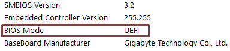
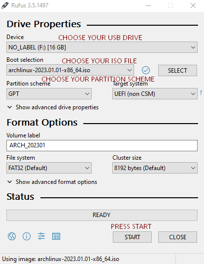

## Introduction

Installing Arch is not as hard as people might think, It's sometimes intimidating but following a few steps will help you understand the process easily. In this guide, I will explain each step of installing Arch and tell you the best practices while doing so.

## Requirements

You'll need a few things to install Arch on your computer:

1. Internet (Ethernet is Recommended)
2. 4GB USB Drive
3. Arch Linux Live Install ISO

## Downloading the Arch Linux ISO

There are a few ways to download Arch, the most common ways are Torrenting and HTTP Direct Downloads. If you are using HTTP Direct Downloads, select the closest server to you, and make sure to compare the checksum after the file has been downloaded. You can find the download page [here](https://archlinux.org/download/).

I will be using Arch version 2023.01.01

## Writing the ISO to a USB

To install Arch, you first need to write the ISO file to your USB Drive, to do so, you can use programs like [Rufus](https://rufus.ie/en/) or [Balena Etcher](https://www.balena.io/etcher). Both can do the same thing but Balena Etcher is easier to use if you've never done this before. I will show you how to flash using Rufus:

**WARNING**
_**This will erase everything on your USB Drive, please backup your files before continuing.**_

Rufus may seem more advanced, but it is really simple, follow these simple steps:

- Select your USB Drive in the first option
- Select your Arch Linux ISO
- Select your Partition Scheme (More info below)

### How to find your partition scheme

Press `Win+R` and type `msinfo32` and press Enter.

You will see a new window popup, look for something called `BIOS Mode` and you should see either `Legacy` or `UEFI` on the right.

This means which mode your BIOS uses to manage drives and partitions.
There is the Legacy mode (BIOS + MBR) and UEFI mode (UEFI + GPT).

UEFI is newer and you will most likely support it if your Laptop or Motherboard is somewhat new.

If it says UEFI then select GPT in Rufus, otherwise select MBR and press START.

### Rufus Settings

## Booting into Arch Linux Live Installer

To be continued...
